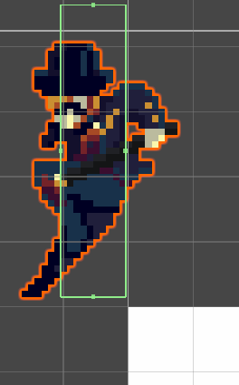

# Module-Berserk

## TODO (노션에 다음 목표로 포함되지는 않았지만 언젠가 처리해야 할 작업)
- 아주 높은 곳에서 추락하는 상황에서 카메라 추적 좌표의 y값 조정하기
  - 지금은 땅에 닿을 때마다 y축 추적이 들어가서 플레이어가 시야 밖으로 나가는 상황도 가능함
  - 만약 맵의 수직 높이가 제한적이라면 지금 상태를 유지해도 상관 없음

## Known Issues
### 플랫폼 끝에 아슬아슬하게 걸치지 않아야 할 위치에서 리지드바디가 멈추는 경우가 드물게 발생함

- 아니 이게 왜 멈춰???

## 리팩토링 후보 (생각날 때마다 기록)

## 코드로 파악하기 힘든 중요한 사항
### 게임의 저장/불러오기 구조
- 모든 scene이 self-contained 하도록 만들기 위해 플레이어나 UI같은 요소는 scene마다 하나씩 생성됨
- scene을 넘어갈 때 유지되는 정보는 모두 GameState라는 클래스로 관리함
- 현재 세션의 GameState는 GameStateManager에서 가져올 수 있으며,  
플레이어 등의 요소는 scene이 로딩된 직후 GameState를 참고해 이전 scene에서의 상태를 복원함
  - GameState는 복사가 아니라 참조 형식으로 처리되므로  
  peripheral한 플레이어같은 오브젝트와 다르게 실시간으로 변조/유지됨!
  - 예를 들어, PlayerState를 참조 및 조작하는 PlayerManager 스크립트는  
  scene마다 하나씩 생성/초기화되지만 PlayerState 자체는 scene 전환에도 삭제되지 않아서  
  기어 시스템에 의한 버프나 HP 상태 등을 그대로 유지한 채로 이동하게 됨
- 정상적인 게임플레이의 경우 메인 화면에서 세이브 데이터를 선택한 뒤 게임이 진행되므로  
GameStateManager.ActiveGameState에 해당 세이브 데이터가 할당됨.  
하지만 테스트 도중에는 미션 한가운데에서 시작하게 될 수도 있으므로 (ex. 보스전만 테스트)  
이 경우에는 더미 GameState를 생성해 사용함.

### Scene 내부의 카메라 transition
- 미션은 여러개의 stage로 구성되는데, stage 사이에는 카메라를 공유하지 않음
- 한 stage의 카메라는 cinemachine camera confiner로 정의된 범위 안에서만 움직임
- 새로운 맵을 만들 때 해야하는 일
  1. stage마다 Follow Camera 프리팹 하나씩 배치
  2. 처음에 보여줄 카메라를 제외하면 virtual camera의 priority를 5로 낮추기
  3. Follow Camera 하나마다 Camera Confinement 프리팹 배치하고  
  PolygonCollider2D를 카메라가 움직일 수 있는 영역에 맞게 조정하기
  4. Follow Camera의 Cinemachine Confiner 2D 컴포넌트의  
  Bounding Shape 2D에 방금 만든 콜라이더 레퍼런스로 넣어주기
  5. 다른 stage로 넘어가는 입구마다 CameraTransitionOnContact 프리팹을 배치하고  
  해당 영역의 virtual camera를 PlayerContactTrigger 스크립트에 레퍼런스로 넣어주기
- 참고: 카메라 blending 시간은 main camera의 cinemachine brain 컴포넌트에서 수정 가능

### Project Setting에서 Physics2D multithreading 옵션 활성화함
- 혹시 나중에 물리 관련해서 오류 발생하면 멀티스레딩을 의심해볼 것

### Pixels Per Unit 및 카메라 Ortho Size
- 모든 스프라이트의 PPU는 32로 설정
- 기준 해상도 480x270을 유니티 단위로 변환하면 아래와 같음

  ||가로|세로|
  |-|-|-|
  |픽셀 단위|480|270|
  |유니티 단위|480 / 32 = 15|270 / 32 = 8.4375|
- 카메라의 Ortho Size는 view 높이의 절반이므로 8.4375 / 2 = 4.21875 unit이 되어야 함

### 충돌 레이어 설정
#### 레이어 분류
- Character: 주인공 또는 적이 사용하는 레이어로 Character끼리는 충돌 x
- Weapon: 공격 범위로 사용하는 콜라이더에 할당되는 레이어. Weapon끼리는 충돌 x
- Interactable: 상호작용 가능한 물체에 할당되는 레이어. Character만 충돌 가능.
- Ground: 밟을 수 있는 지형지물에 할당되는 레이어.
#### 사용 예시
- 주인공 본체는 Character 레이어
- 적 본체에는 Character 레이어
- 적의 무기에는 Weapon 레이어
- 이렇게 하면 주인공과 적은 서로를 지나칠 수 있으면서도 무기에 의한 충돌 트리거는 정상 작동함
- 주인공 무기도 Weapon 레이어로 해야만 무기 공격 판정에 상호작용 가능한 물체가 반응하는 것을 예방할 수 있음

### 경직 및 경직 저항력
- None, Weak(평타), Strong(긴급 회피)으로 분류
- 잡몹은 평상시에 경직 저항력이 None이지만 공격 모션에는 Weak 저항을 가짐
- 보스는 평상시에 경직 저항력이 Weak이지만 패턴 시전 중에는 Strong 저항을 가짐
- 경직 저항력 이하의 공격은 데미지는 입어도 경직 & 넉백은 무시함

### OneWayPlatform 태그
- 아래 방향키를 두 번 빠르게 눌러 바닥으로 뚫고 들어가려면  
해당 플랫폼이 Ground 레이어이고 "OneWayPlatform"이라는 태그를 가져야 함.

### 공격 애니메이션 새로 임포트할 때 아래 이벤트 추가해줘야 함
1. OnEnableAttackCollider, OnDisableAttackCollider
  - 실제 공격 판정의 시작과 끝에 설정
2. OnBeginAttackInputBuffering
  - 공격 판정이 시작되는 프레임의 바로 다음 프레임에 설정
  - 이 이벤트가 실행되기 전에는 공격 키를 눌러도 선입력으로 취급되지 않음
3. OnStartWaitingAttackContinuation
  - 선입력을 처리해 다음 공격 모션으로 넘어갈 시점에 설정
  - 이 이벤트를 없애면 자세 복귀 모션을 강제할 수 있음  
    => 지금은 마지막 공격 모션에 이걸 없애서 연속 공격 사이에 딜레이를 넣어주고 있음
4. OnAttackMotionEnd
  - 공격 모션의 제일 마지막 프레임에 설정
  - PlayerManager가 공격 모션 종료를 이 이벤트로 판단함!
  
### 공격 애니메이션들의 pivot은 중심으로 고정되지 않고 계속 변함!
- PlayerManager의 ApplyAttackRootMotion() 함수 참고 바람
- 원본 에셋 자체에 이동이 포함되어서 이를 스프라이트 상의 이동이 아니라  
rigidbody의 이동으로 변환하기 위해 꼼수를 조금 썼음
- 처음 보면 이게 뭐지 싶을 수 있으니 주석을 꼭 읽어주십쇼
- 이 방식을 계속 사용할거면 다음 요구조건을 만족해야 함
  1. 공격 애니메이션의 그림 자체에 이동이 포함될 것 (캐릭터가 이동하면 중심에서 벗어나야 함)
  2. 유니티에 에셋 임포트한 뒤 프레임 별로 pivot을 수동으로 중심에 맞춰줄 것

### 캐릭터 콜라이더를 발보다 조금 위로 설정해야 지면과 접촉하는 것으로 표시됨
- 정확히 발 밑까지 포함시키면 어째서인지 공중에 떠있는 것처럼 보임

### UI 요소들의 입력 처리 방식
- 최상단 UI만 입력을 처리하도록 스택 구조를 채용함
- UI가 생길 때 UserInterfaceStack.PushUserInterface(this),  
UI가 사라질 때 UserInterfaceStack.PopUserInterface(this)를 호출해줘야 함.
- 자신이 최상단 UI가 되는 순간에 BindInputActions()라는 함수가 실행됨
  1. InputAction에 직접 콜백 등록
  2. 버튼, 슬라이더 등 조작 가능한 UI 요소의 interactable 플래그 true로 설정
  3. UI navigation을 위해 EventSystem의 SetSelectedGameObject()로 기본 선택 요소 정해주기
- Push, Pop 순서를 지켜줘야 오류가 발생하지 않으니 사용이 끝난 UI는 Pop을 즉각 호출해주는 것이 좋음
  - OnDestroy() 이벤트는 push 순서와 무관하게 일어나므로 reliable하지 않다...
  - 뭔가 이상하면 콘솔에 에러 출력이 없는지 확인해볼 것!